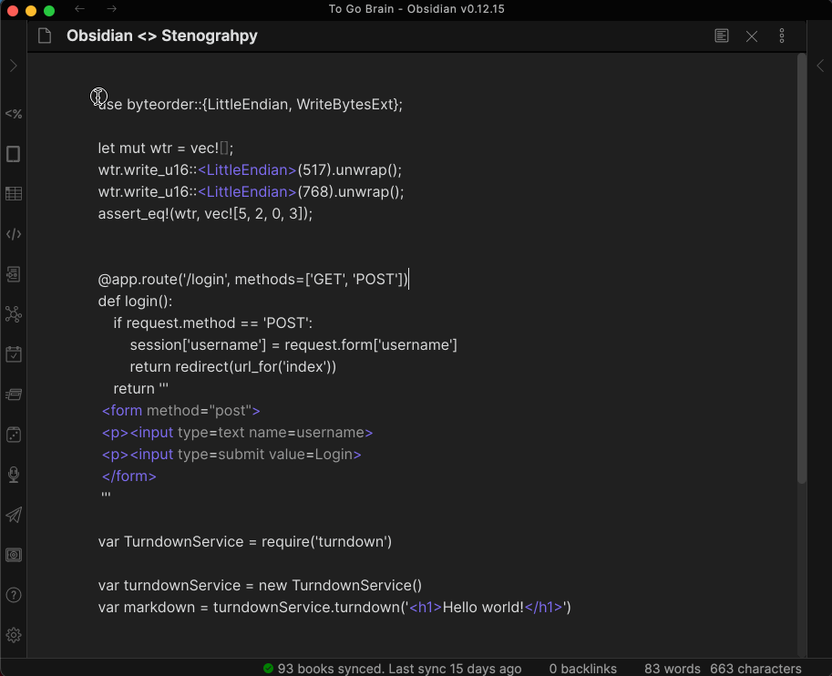

## Stenography Obsidian Plugin

For [Obsidian October 2021](https://publish.obsidian.md/hub/11+-+Events/Obsidian+October+2021)

This plugin uses [Stenography](https://stenography.dev/) to translate selected code blocks into simple English and guess at the language it is written in.

## Installation

Install from the `Community Plugin list` by searching `Stenography`

## Running

Go into Stenography settings and set your API key. You can get an API key [here](https://stenography.dev/dashboard)
To run, highlight an unedited code block and click the Stenography Ribbon Icon (`code-glyph`)

See gif below!

